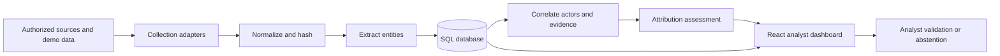
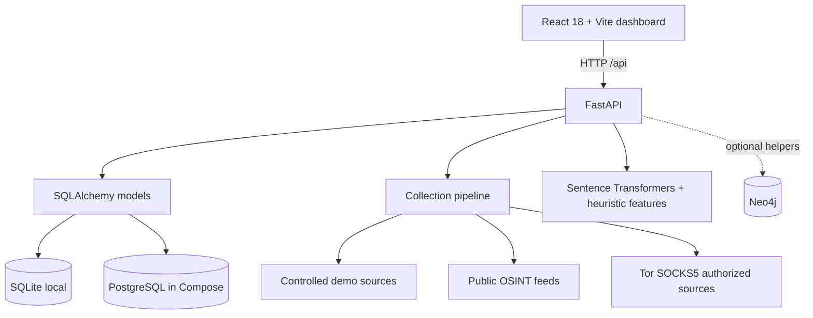

# DHRUVA

### Dark-web Hunt & Relationship-based Unified Verification Architecture

**SIH 2026**

DHRUVA is an AI-assisted dark-web intelligence platform for evidence-backed relationship discovery, infrastructure correlation, and attribution assessment. It collects authorized observations, extracts identifiers, correlates entities and infrastructure, and produces inspectable assessments for analyst review. Some internal paths and identifiers retain the legacy `darktrace` name to avoid breaking the existing implementation.

> A correlation is not proof of identity. DHRUVA produces analyst-supporting assessments from incomplete and potentially misleading observations. Findings require provenance review, contradictory-evidence analysis, and independent validation.

**From fragmented observations to evidence-backed relationships.**

## Overview

The repository contains a React dashboard, a FastAPI service, SQLAlchemy data models, collection adapters, local demonstration data, graph helpers, and an attribution engine. The default non-Docker path uses SQLite. Docker Compose provisions PostgreSQL and Neo4j alongside the application, although the current API primarily builds graph responses from relational records; direct Neo4j helpers exist but are not the main request path.

## Problem Statement

Threat-actor activity is fragmented across handles, posts, wallets, PGP identifiers, domains, hidden services, and time. Analysts need a way to organize those observations, preserve their source context, compare multiple signals, and expose uncertainty without turning similarity into an unsupported identity claim.

## Proposed Solution

DHRUVA brings collection, normalization, entity extraction, evidence storage, relationship visualization, and multi-signal assessment into one controlled workspace. It supports synthetic demo content, public OSINT feeds, a DeepDarkCTI catalogue integration, and analyst-authorized Tor collection. The platform then compares semantic, stylometric, behavioral, handle, and graph signals and records an assessment with supporting evidence.

## Key Capabilities

- Actor, handle, PGP, wallet, domain, service, observation, alert, and relationship records.
- Controlled synthetic seed data and a self-hosted mock forum for repeatable demonstrations.
- Optional Tor SOCKS5 collection with explicit source authorization and reachability checks.
- DeepDarkCTI catalogue refresh, source enable/disable controls, collection, and scheduler endpoints.
- Entity extraction for handles, email addresses, wallets, PGP material, and onion addresses.
- Actor profiles, timeline, relationship graph, infrastructure, alerts, crawler monitoring, model status, Robin search, and reports screens.
- CSV, JSON, and STIX 2.1 exports implemented in the browser.
- Analyst review actions for linking or dismissing observations.

## How DHRUVA Works



Collection records include source, collection method, timestamps, reliability, extracted entities, and content hashes. The pipeline can propose candidate relationships; the analyst remains responsible for interpreting and validating them.

## System Architecture



See [system architecture](docs/architecture/system-architecture.md) and [data flow](docs/architecture/data-flow.md).

## Technical Workflow

1. A source is created or imported and marked for authorized collection.
2. An adapter retrieves controlled, public, or Tor-routed content.
3. The pipeline normalizes content and records provenance metadata and SHA-256 evidence hashes.
4. Entity extraction identifies handles, wallets, email addresses, PGP material, domains, and onion services.
5. SQLAlchemy persists observations and candidate actor links.
6. The attribution endpoint compares two actors across available evidence.
7. The dashboard displays scores, evidence, relationships, timelines, and analyst controls.

## Evidence Correlation

The active backend assessment engine uses a weighted fusion of:

| Signal | Implementation |
|---|---|
| Semantic | Mean `all-MiniLM-L6-v2` embeddings and cosine similarity when the model is available |
| Stylometric | Nine text features compared with normalized distance |
| Behavioral | Posting-time distributions and temporal similarity |
| Handle | Jaro-Winkler-style similarity across observed handles |
| Graph | Jaccard-style overlap over shared infrastructure/entity values |

The result is stored as an `AttributionAssessment` with a score, confidence label, explanation, evidence JSON, and a field for negative evidence. Current on-demand assessments initialize negative evidence as empty; demo/seeded assessments may contain contradictory evidence.

## Attribution Assessment

DHRUVA performs **AI-assisted evidence correlation and attribution assessment**. The score is a prioritization aid, not a legal, forensic, or identity determination. If the sentence-transformer model cannot load, the endpoint falls back to a limited handle-overlap heuristic and identifies that fallback in its response.

## Uncertainty & Abstention

The UI distinguishes confidence levels and can display negative/conflicting evidence. The system does not yet implement a dedicated, enforced abstention state. Analysts should treat low-evidence, conflicting, model-unavailable, or provenance-poor results as insufficient and abstain from attribution. Formal evidence sufficiency thresholds and automatic abstention are planned.

## Technology Stack

| Layer | Technology | Purpose |
|---|---|---|
| Frontend | React 18, Vite 8, React Router 7, Axios | Analyst dashboard and API access |
| Visualization | Cytoscape.js, Recharts | Relationship graphs and charts |
| Backend | Python 3.11, FastAPI, Pydantic | HTTP API and configuration |
| Persistence | SQLAlchemy, SQLite, PostgreSQL 15 | Local/demo and Compose-backed relational storage |
| Graph | Neo4j 5 driver and helper module | Optional graph persistence/query support |
| AI/ML | Sentence Transformers, scikit-learn, NumPy, spaCy, MLflow | Embeddings, similarity features, extraction, and experiment support |
| Collection | Requests, HTTPX, Beautiful Soup, Tor SOCKS5 | Authorized content retrieval and parsing |
| Infrastructure | Docker, Docker Compose | Reproducible multi-service development environment |

No Gemini or OpenAI API key is used by the current implementation.

## Project Structure

```text
.
├── ai/                    # Extraction, embedding, behavior, and resolution helpers
├── backend/               # FastAPI application, models, routes, services, migrations, Tor bundle
├── data/                  # Synthetic/demo source material and training pairs
├── frontend/              # React/Vite dashboard
├── graph/                 # Optional Neo4j client and graph queries
├── scripts/               # Seed and demo-model scripts
├── docs/                  # Architecture, setup, deployment, security, API, demo, audit
├── .github/               # CI, secret scanning, issue and PR templates
├── docker-compose.yml
└── requirements.txt
```

Local databases, build output, dependency directories, Tor runtime state, and generated collection output are intentionally excluded from Git.

## Prerequisites

- Git
- Docker Engine/Desktop with Docker Compose v2 for the recommended path
- For manual setup: Python 3.11 and Node.js 20.19 or newer
- Optional: a Tor SOCKS5 proxy on port `9050` for authorized `.onion` collection
- Internet access on first install to download packages and the embedding model

## Local Setup

```bash
git clone <repository-url>
cd dhruva-sih-2026
cp .env.example .env
docker compose up --build
```

PowerShell equivalent:

```powershell
Copy-Item .env.example .env
docker compose up --build
```

Change the development passwords in `.env` before starting. Then open:

- Dashboard: <http://localhost:5173>
- Backend health: <http://localhost:8000/>
- Interactive API docs: <http://localhost:8000/docs>
- Neo4j Browser: <http://localhost:7474>

For the manual Python/Node workflow, see [local setup](docs/development/local-setup.md).

## Environment Configuration

`.env.example` is the complete safe template. It covers PostgreSQL and Neo4j development credentials; backend database, model, MLflow, and CORS settings; Tor; DeepDarkCTI controls; and the public browser API URL. Never put a secret in a `VITE_*` variable because Vite exposes it to browser code.

| Variable | Used by | Purpose |
|---|---|---|
| `POSTGRES_USER` | Compose/PostgreSQL | Local database role; the legacy default is retained for compatibility |
| `POSTGRES_PASSWORD` | Compose/PostgreSQL | Local database password; replace the example value |
| `POSTGRES_DB` | Compose/PostgreSQL | Local database name; the legacy default is retained for compatibility |
| `NEO4J_USERNAME` | Compose/backend | Neo4j login name |
| `NEO4J_PASSWORD` | Compose/backend | Neo4j password; replace the example value |
| `PROJECT_NAME` | Backend | Name returned by the health endpoint |
| `DATABASE_URL` | Backend/SQLAlchemy | Relational database connection URL |
| `NEO4J_URI` | Graph helper | Neo4j Bolt endpoint |
| `CORS_ORIGINS` | Backend | Comma-separated browser origins allowed by CORS |
| `MODEL_NAME` | Analysis | Sentence Transformer model identifier |
| `MODEL_PATH` | Training script | Local model output/input path |
| `MLFLOW_TRACKING_URI` | Training script | MLflow tracking store |
| `API_URL` | Scripts | Backend base URL for integration scripts |
| `TOR_SOCKS_HOST` / `TOR_SOCKS_PORT` | Collection | Authorized Tor SOCKS5 proxy location |
| `ROBIN_SEARCH_ENGINES_JSON` | Robin search | Optional JSON list of analyst-authorized `.onion` search endpoints; empty by default |
| `DEEPDARKCTI_REFRESH_INTERVAL` | Collection | Catalogue refresh interval in seconds |
| `DEEPDARKCTI_COLLECT_INTERVAL` | Collection | Collection-cycle interval in seconds |
| `DEEPDARKCTI_MAX_SOURCES_PER_CYCLE` | Collection | Per-cycle source cap |
| `DEEPDARKCTI_COLLECT_TIMEOUT` | Collection | Per-source timeout in seconds |
| `VITE_API_URL` | Browser | Public backend URL compiled into the frontend |

Compose also sets `VITE_PROXY_TARGET` internally for the Vite development proxy; it does not contain a secret.

Do not commit `.env`. The backend reads the repository-root `.env`, an optional `backend/.env`, and process environment variables. Process environment values take precedence.

## Running the Project

Recommended:

```bash
docker compose up --build
```

Seed a local SQLite demo database outside Docker:

```bash
python scripts/seed_db_sqlite.py
```

The Compose stack uses PostgreSQL. To seed its disposable demo database:

```bash
docker compose exec backend python scripts/seed_database.py
```

The seeder clears and repopulates its target tables. Never run it against a database you need to preserve.

## Docker Setup

Compose starts `frontend`, `backend`, `postgres`, and `neo4j`. Named volumes retain database data across restarts. Tor is not installed in the Linux backend image; point `TOR_SOCKS_HOST` at an authorized reachable proxy, or use the controlled demo without Tor. Full details are in [Docker deployment](docs/deployment/docker.md).

## API Documentation

FastAPI exposes OpenAPI and Swagger UI at `/docs` while the backend is running. A route-family overview is available in [API documentation](docs/api/endpoints.md).

## Testing

```bash
python -m pytest backend/tests -q
cd frontend && npm ci && npm run build
docker compose config --quiet
```

There is currently no configured frontend lint script or browser test suite. Network-dependent integration scripts under `backend/scripts/` are not part of default CI.

## Security

- Secrets and local databases are ignored; CI performs secret scanning with Gitleaks.
- Compose credentials come from `.env` rather than committed service definitions.
- CORS defaults to local Vite origins instead of allowing every origin.
- Collection can create network and legal risk; only use sources you are authorized to access.
- The API currently has no authentication or authorization and is suitable only for isolated development/demo environments.

Read [SECURITY.md](SECURITY.md), the [threat model](docs/security/threat-model.md), and [data handling](docs/security/data-handling.md).

## Responsible Use

DHRUVA is intended for authorized cybersecurity research, defensive security, threat intelligence, academic research, controlled demonstrations, and lawful investigations. Evidence may be incomplete, deceptive, stale, or coincidental. Preserve provenance, examine contradictions, validate findings independently, and abstain when the record is insufficient. Do not use the project to facilitate unauthorized access, surveillance, harassment, or illegal marketplace activity.

## Limitations

- No authentication, role-based access control, or production deployment hardening.
- The primary API graph view is generated from relational records; Neo4j integration is auxiliary.
- Automatic abstention and calibrated evidence-sufficiency thresholds are not implemented.
- New on-demand assessments do not currently populate negative evidence automatically.
- The first transformer-model use may download a model and may fail offline.
- Tor availability and external feeds are environment- and network-dependent.
- Some screens include demo fallbacks or synthetic records; they must not be represented as live intelligence.
- Frontend bundles are large and currently emit a Vite chunk-size warning.
- Infrastructure scanning is restricted to public hosts on ports 80 and 443; private, loopback, link-local, and reserved addresses are rejected.
- A direct-dependency Python audit reports unresolved advisories in the pinned 2023 dependency set, especially the optional MLflow training dependency; see the repository audit before any non-isolated deployment.

## Demo Workflow

Use synthetic data for a deterministic SIH presentation:

1. Start the stack and confirm the API health response.
2. Seed demo data if the database is empty.
3. Open Command Center and show current counts.
4. Open Actors and select an actor profile.
5. Use Graph Intelligence and Timeline to inspect relationships and events.
6. Compare two actors in Persona Analysis and explain each subsystem score.
7. Show positive and, where present, conflicting evidence in Reports.
8. Export CSV, JSON, or STIX 2.1.
9. Close by stating why the assessment requires analyst validation and when to abstain.

See the complete [SIH demo guide](docs/demo/demo-guide.md).

## Project Status

### Implemented

- FastAPI API, React dashboard, relational models, SQLite/PostgreSQL support.
- Demo seeding, actor/profile/timeline/graph views, alerts, infrastructure view, crawler monitoring.
- Multi-signal assessment with model-unavailable fallback.
- Controlled mock forum, public OSINT integrations, Tor-aware adapters, DeepDarkCTI and Robin endpoints.
- CSV, JSON, and STIX 2.1 browser exports.

### Partially Implemented

- Neo4j exists as an optional helper but is not the primary graph API store.
- Negative-evidence presentation exists, but live assessment generation does not derive it.
- Tor collection depends on an external or bundled Windows Tor runtime and source authorization.
- MLflow training support exists as a script, not as an integrated UI workflow.

### Planned / Not Implemented

- Authentication, roles, audit logging, and production access controls.
- Enforced uncertainty thresholds and explicit automatic abstention.
- PDF export (the interface implements CSV, JSON, and STIX 2.1).
- Production-grade task queues, observability, and deployment manifests.

## SIH 2026

DHRUVA is packaged for the Smart India Hackathon 2026 evaluation context. It demonstrates how fragmented observations can be normalized, related, and reviewed without treating automated correlation as proof. Judges should use the synthetic/controlled demo path unless the presenting team has explicit authorization for a live source.

## Team

Team member names, institution, SIH problem-statement ID, and contact details were not present in the repository and should be added by the repository owner before submission.

## License

No license file or clear licensing intent was present. The repository owner must select and add an appropriate license before public release. Until then, no permission to copy, modify, or distribute the code is granted by default.

## Further Documentation

- [Repository audit](docs/REPOSITORY_AUDIT.md)
- [Correlation pipeline](docs/architecture/correlation-pipeline.md)
- [Testing guide](docs/development/testing.md)
- [Contributing](CONTRIBUTING.md)
- [Security policy](SECURITY.md)
- [Changelog](CHANGELOG.md)
