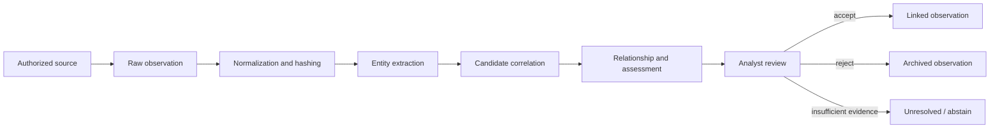

# Correlation Pipeline

## Evidence boundary

DHRUVA distinguishes a raw observation from an analytical interpretation. A raw observation stores retrieved content, source context, collection time, method, reliability, extracted entities, and a SHA-256 content hash. A candidate actor link, relationship, confidence label, or attribution score is an interpretation derived from that record; it is not rewritten as source evidence.

## Implemented signals

| Signal | Current implementation | Interpretation caution |
|---|---|---|
| Identity | Handle similarity, shared wallets, and PGP identifiers | Reuse, impersonation, and planted identifiers can create false links |
| Infrastructure | Shared domains, services, indicators, certificate fingerprints, and graph overlap | Shared hosting and common services weaken exclusivity |
| Behavioral | Posting-hour histograms | Sparse timestamps and timezone assumptions can distort similarity |
| Stylometric | Nine normalized text features | Short, translated, copied, or deliberately altered text is unreliable |
| Semantic | Mean sentence-transformer embeddings and cosine similarity | Topic similarity is not identity similarity |
| Temporal | Timeline ordering and activity distributions | Co-occurrence alone does not establish a relationship |

The active assessment service weights semantic, stylometric, behavioral, handle, and graph signals. It stores an overall score, confidence label, explanation, and per-signal evidence JSON. The source code, rather than this document, remains authoritative for exact weights.

## Supporting and contradicting evidence

Positive subsystem scores and shared indicators are supporting evidence. The schema and reports UI can retain and display negative evidence, but newly generated assessments currently initialize that field as empty. Automatic contradiction discovery and an enforced abstention state are not implemented. Analysts must inspect provenance, seek independent evidence, and leave a conclusion unresolved when evidence is sparse or contradictory.
