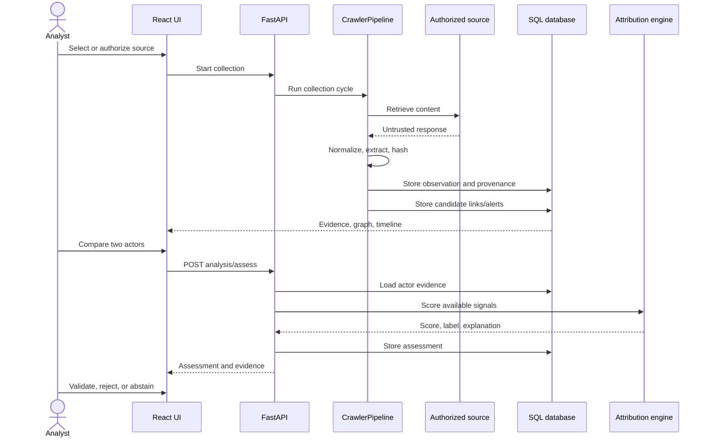

# Data Flow

## Collection and Correlation

## Evidence Records

An observation can include source name/type, seed identifier, service, title, content, raw reference, collection method, reliability, collection timestamps, extracted entities, metadata, and a SHA-256 content hash. Hash verification detects a mismatch in stored content; it is not a third-party timestamp or proof of source identity. The schema also contains blockchain anchor fields, but the current repository does not establish an external blockchain anchoring service.

## Attribution Inputs and Outputs

For two actor records, the API gathers posts, handles, wallets, PGP identifiers, domains, services, and timestamps. Available subsystems produce normalized scores that are fused into an overall assessment. Missing transformer capability is represented by a fallback result. On-demand assessments currently save an empty negative-evidence object; analysts must explicitly examine contradictory context.

## Data Destinations

- SQLite file for local/manual development by default.
- PostgreSQL named volume in Compose.
- Browser memory and downloads for CSV, JSON, and STIX exports.
- JSON runtime files for crawler/Robin output where those features are used; these are ignored by Git.
- Optional Neo4j through helper code, not the main API persistence path.

