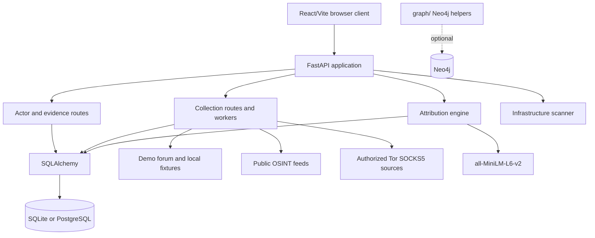

# System Architecture

## Scope

DHRUVA is a local research/demo application with a React frontend and FastAPI backend. It supports SQLite for the simplest run and PostgreSQL in Docker Compose. Neo4j is provisioned and has a client/helper module, but current API graph responses are assembled from SQLAlchemy entities and relationships.

## Components

### Frontend

`frontend/src/main.jsx` loads `App.jsx`. React Router exposes Command Center, Actors, Persona Analysis, Graph Intelligence, Timeline, Infrastructure, Darknet Collection, Robin Search, Alerts, Reports, AI Models, and Architecture pages. Investigations and Settings are currently placeholders. Most pages call `http://localhost:8000`; dashboard calls under `/api` can use the Vite proxy.

### Backend

`backend/app/main.py` creates the FastAPI application and mounts actors, ingest, analysis, crawler, alerts, infrastructure, and DeepDarkCTI routers. It creates SQL tables on startup and starts a background ingestion worker on the FastAPI startup event. API documentation is generated by FastAPI at `/docs`.

### Persistence

SQLAlchemy models represent actors, handles, PGP identifiers, wallets, posts, hidden services, domains, infrastructure indicators, sources, relationships, assessments, seed sources, observations, and alerts. SQLite is the configured code fallback. Compose overrides `DATABASE_URL` for PostgreSQL.

### Collection

The crawler layer includes adapters, normalization, entity extraction, a forum parser, breach lookup, public OSINT feed helpers, Robin search, DeepDarkCTI catalogue import/collection, and a background worker. `.onion` retrieval uses a SOCKS5 proxy and must be restricted to authorized sources. A bundled Windows Tor binary is present for local Windows use; the Linux container expects an external reachable proxy.

### Analysis

The active service under `backend/app/services/ai/attribution.py` calculates semantic, stylometric, behavioral, handle, and graph/infrastructure overlap scores. Sentence Transformers is lazy-loaded. If loading or inference fails, the analysis route provides a limited heuristic fallback.

## Trust Boundaries

- Browser to API: untrusted client input; no authentication is currently implemented.
- API to external sources: untrusted content and server responses.
- API to Tor proxy: external process/network boundary.
- API to databases: contains potentially sensitive intelligence and inferred links.
- Model downloads and Python/npm dependencies: software supply-chain boundary.

Do not expose this development architecture directly to the internet.

